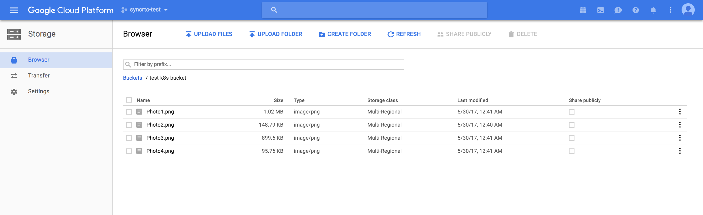
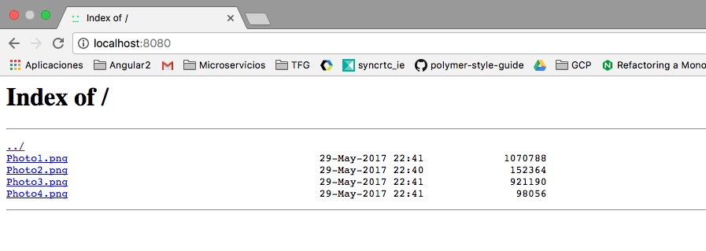

# k8s-storage-buckets

[Kubernetes]'s volumes are in a rough way understood as directorys which are accessible to the containers in a pod. 

When using a [Microservice] architecture where all your services are loosely coupled, you may have a problem when scalig services that share files. A good aproach for this could be a distributed filesystem. 

Kubernetes suports different kinds of [volumes], but most of them are persistent volumes, which lead to some problems when scaling.

The volumes which can be integrated with the main cloud plattforms (AWS,GCP,Azure) are:
+ ``gcePersistentDisk``
+ ``awsElasticBlockStore``
+ ``azureFileVolume``
+ ``azureDisk``

From this ones, the only one suppoting a distributed filesystem is ``azureFileVolume`` which uses [Azure File Storage].

But looking into [AWS] and [GCP] products, you can find distributed systems among their products:

+ AWS: [S3 Buckets]
+ GCP: [Cloud Storage]

[Azure File Storage]:https://azure.microsoft.com/es-es/services/storage/files/
[volumes]:https://kubernetes.io/docs/concepts/storage/volumes/
[Kubernetes]:https://kubernetes.io/
[AWS]:https://aws.amazon.com/es/products/
[GCP]:https://cloud.google.com/products/
[S3 Buckets]:https://aws.amazon.com/es/s3/
[Cloud Storage]:https://cloud.google.com/storage/

This means that we have to mount this filesystems in a "custom" way thus not being implemented natively.

## Distributed filesystem using Cloud Storage
Google's [Cloud Storage] provides a object-based distributed filesystem which can be mounted into your container using Google´s [gcsfuse] [FUSE-based file system]. 

Here are steps needed to achieve this through a practical example.





[gcsfuse]:https://github.com/GoogleCloudPlatform/gcsfuse
### Authenticate with Google API credentials JSON

Here you can provide your [Google application default credentials] to authenticate and start using Google Cloud Storage.
After downloading your JSON credentials file, create a secret object inside your Kubernetes cluster.

[Google application default credentials]:https://developers.google.com/identity/protocols/application-default-credentials#howtheywork


```
kubectl create secret generic storage-auth-credentials --from-file=credentials=path/to/json
```
After this, make sure that you use the [secret] and mount it as a volume inside the gcsfuse container. This looks like this:
```
# Define your volumes 
volumes:
        - name: storage-credentials
          secret:
            secretName: storage-auth-credentials
            items:
              - key: credentials
                path: storage-credentials.json
...
# Mount it as a volume from the secret
volumeMounts:
          - name: storage-credentials
            mountPath: /auth
            readOnly: true
```

### Authenticate providing Google GKE cluster scope
Another way to authenticate is [providing your GKE cluster the OAuth scope] ``storage-rw`` (Cloud Storage read/write). Automatically, all VMs created (your cluster nodes) will have authenticated access to your buckets. It should look like this:
```
gcloud container clusters create your-cluster --scopes=https://www.googleapis.com/auth/devstorage.read_write
```
[providing your GKE cluster the OAuth scope]:https://cloud.google.com/sdk/gcloud/reference/container/clusters/create

### NGINX - GCSFUSE in same container
```
docker build -t nginx-gcsfuse:v1 .
# Running in docker
docker run --privileged -d -p 8080:8080 nginx-gcsfuse:v1
#Running in k8s
kubectl create -f nginx-gcsfuse-mono.yaml
kubectl scale --replicas=3 deploy/nginx 
```

### NGINX - GCSFUSE in k8s with init containers (Just Read Access)
Using an [emptyDir] volume mounted by a [initContainer]
```
kubectl create -f nginx-gcsfuse-init.yaml
```
[emptyDir]:https://kubernetes.io/docs/concepts/storage/volumes/#emptydir
[initContainer]:https://kubernetes.io/docs/concepts/workloads/pods/init-containers/

## Distributed filesystem using AWS
It is possible to mount [S3 Buckets] inside your pod, for this it's needed a [FUSE-based file system] like [s3fs-fuse], wich allows you to authenticate to AWS and mount the bucket in your container.

Examples for this will be implemented in the future.

[s3fs-fuse]:https://github.com/s3fs-fuse/s3fs-fuse
[FUSE-based file system]:https://en.wikipedia.org/wiki/Filesystem_in_Userspace

## Distributed filesystem using Azure
As told above, kubernetes supports natively a volume called [AzureFileVolume] that uses [Azure File Storage]. That it can be used inside the ``deployment`` using a [secret] with Azure´s credentials. 

Here is a more detailed [example] from the Kubernetes repo:
```
volumeMounts:
      - name: azure
        mountPath: /mnt/azure
...
# Mount it as a volume using a secret
volumes:
      - name: azure
        azureFile:
          secretName: azure-secret
          shareName: k8stest
          readOnly: false
```

Examples for this will be implemented in the future.

[secret]:https://kubernetes.io/docs/concepts/configuration/secret/
[s3fs-fuse]:https://github.com/s3fs-fuse/s3fs-fuse
[AzureFileVolume]:https://kubernetes.io/docs/concepts/storage/volumes/#azurefilevolume
[example]:https://github.com/kubernetes/kubernetes/tree/master/examples/volumes/azure_file